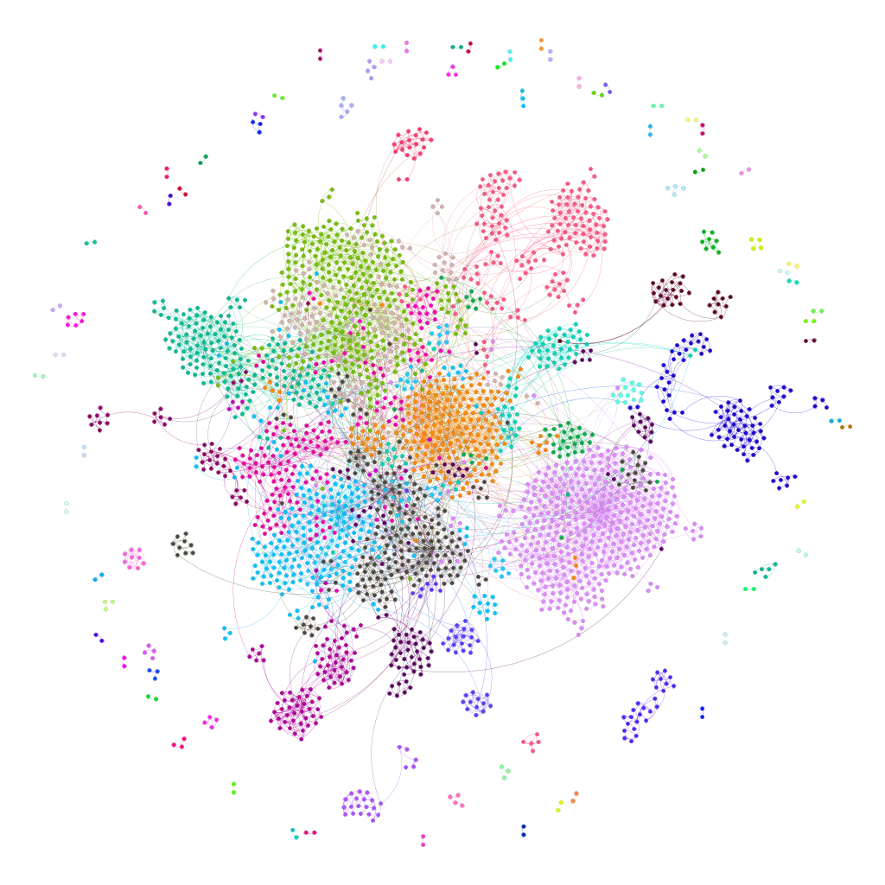
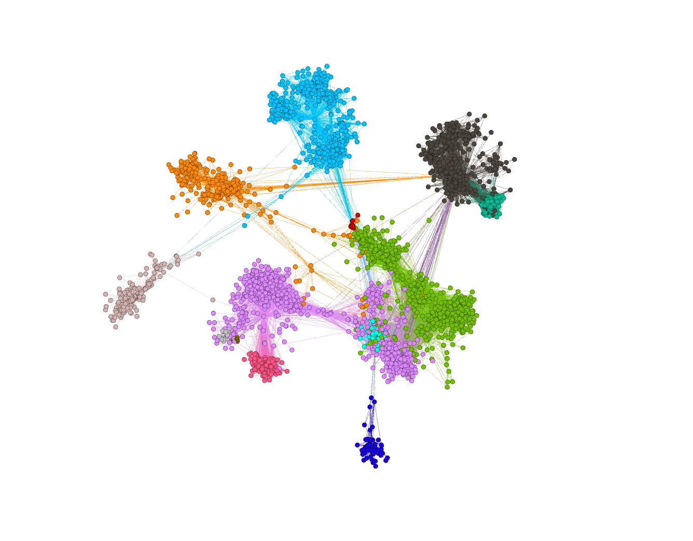

# Leader-Based Community Detection Algorithm in Attributed Networks

)

A powerful Leader-Based Community Detection Algorithm tailored for Attributed Networks. This algorithm utilizes cutting-edge techniques to identify and analyze communities in networks with attribute information.

## Table of Contents

- [Introduction](#introduction)
- [Features](#features)
- [Methodology](#Methodology)
- [Datasets](#Datasets)
- [Results](#Results)
- [Visualizations](#Visualizations)

## Introduction

This project, titled ”Leader-Based Community Detection Algorithm in Attributed Networks,” addresses the challenge of identifying central leaders and
organizing communities within complex networks enriched with attributes. The
relevance of this problem lies in its potential to revolutionize decision-making,
optimize resource allocation, and enhance collaboration efficiency across diverse
domains. Motivated by the need for nuanced insights into leadership dynamics,
our project proposes a novel algorithm integrating data analysis techniques and
advanced community detection methods. Persistent challenges include the intricate
interplay between attributes and network structures. Our work aims to
overcome these challenges, contributing to a deeper understanding of attributed
networks for informed decision-making and resource optimization.

## Features

- **Leader-Centric Approach**: The algorithm revolves around identifying influential leaders within the network to reveal key community structures.

- **Attribute Integration**: Harness the power of attribute information to enhance the accuracy and relevance of community detection.

- **Scalability**: Efficient and scalable implementation suitable for large attributed networks.

- **Visualization**: Visualize the detected communities and leader nodes for better interpretability.

## Methodology
Our solution integrates data analysis techniques with advanced community detection methods, such as Eigenvector centrality and the Louvain method.

## Datasets
We tested our algorithm on two distinct datasets:
1. Facebook Dataset
2. Cora Dataset

## Results
The algorithm demonstrated effectiveness in uncovering meaningful communities within attributed networks. This project has potential applications in enhancing decision-making and resource optimization across various domains.

## Visualizations
The project also provides visualizations of the network and community structures, offering valuable insights into social dynamics and scientific collaboration patterns.

- **Visualizations of Cora Dataset**

- **Visualizations of Facebook Dataset**
  

